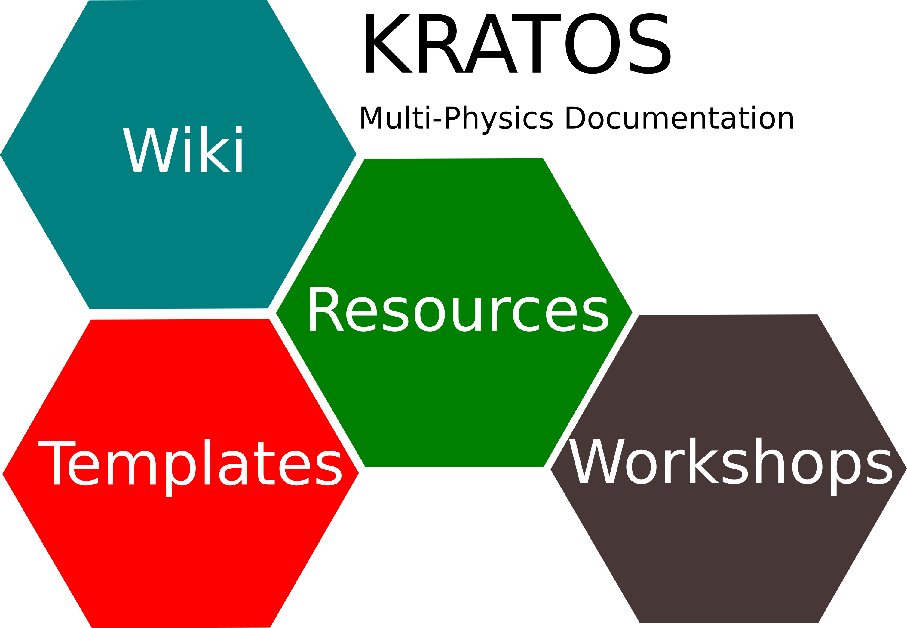

# Documentation

 

This repository hosts the documentation related with _Kratos Multi-Physics_. The current sections added to this repository are the corresponding ones:

* **Wiki**: In this section the images, files and documentation shown in the Kratos Multi-Physics Wiki are stored.
* **Templates**: Here the templates used in $\TeX$ and other documentations is avalaible for your use.
* **Resources**: Presentations, and any other documentation related with Kratos Multi-Physics.

In the future more sections will be added as it is need to provide a 